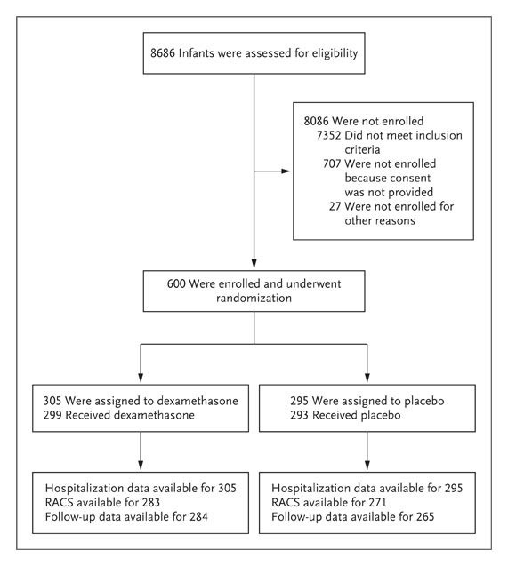
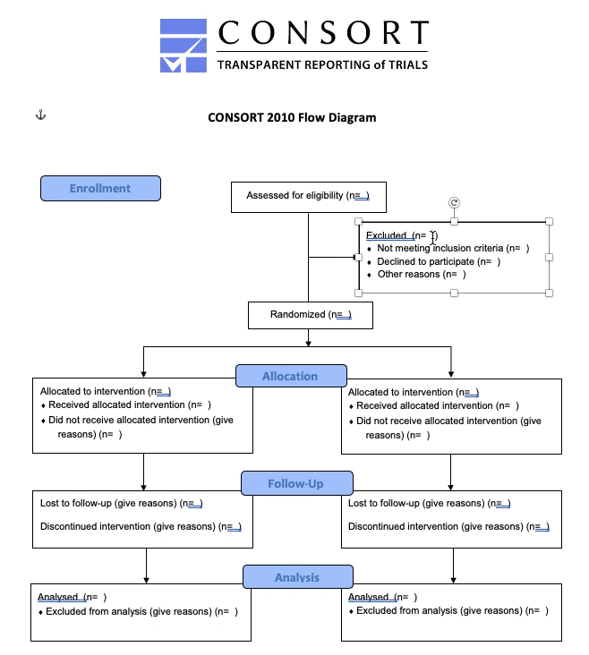
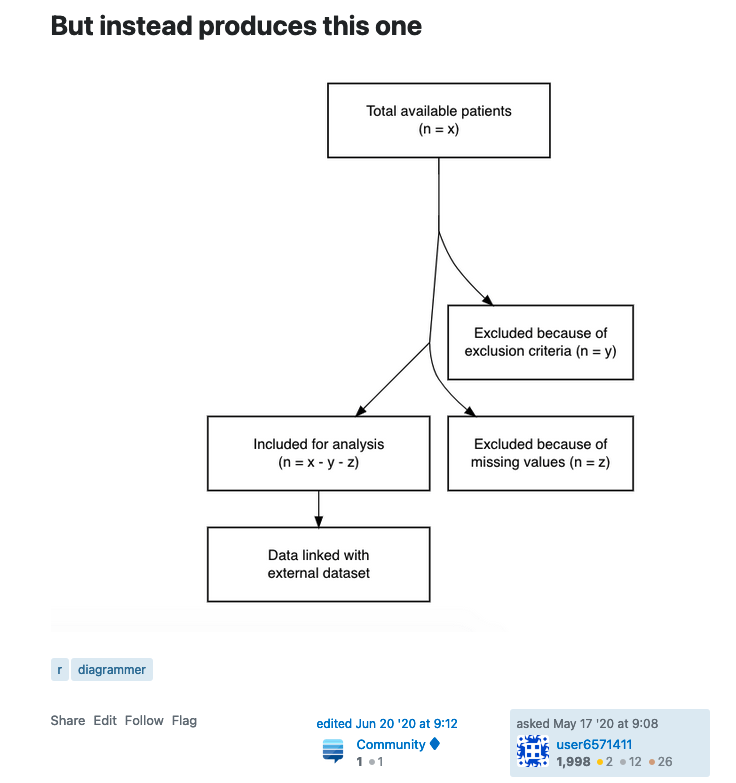
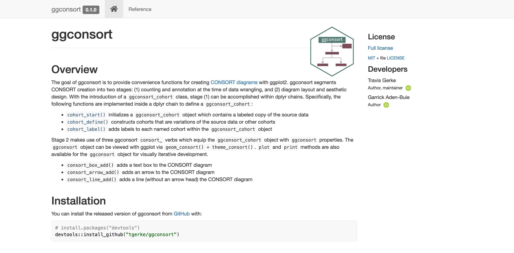
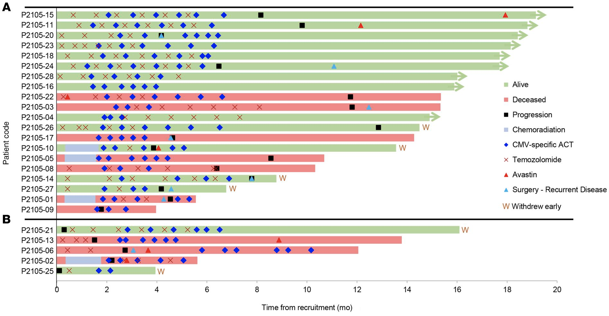
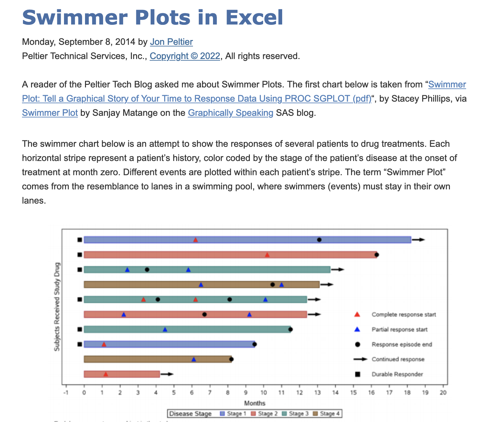

```{r xaringan-themer, include=FALSE, warning=FALSE}
library(xaringanthemer)

style_duo_accent(
  primary_color = "#4e796f",
  secondary_color = "#794e58",
  colors = list(
    offwhite = "#f5f0e4",
    green = "#4e796f",
    burgundy = "#794e58",
    purple = "#5A4E79",
    lightgreen = "#6E794E"
  ),
  extra_fonts = list(google_font("Raleway"))
)

xaringanExtra::use_extra_styles(
  mute_unhighlighted_code = TRUE  #<<
)
```

```{r setup, include=FALSE, warning=FALSE}
library(dplyr)
library(ggplot2)
library(ggconsort)
library(ggswimlane)

# higlight code from
# https://www.garrickadenbuie.com/blog/highlight-lines-without-breaking-the-code-in-xaringan/
hook_source <- knitr::knit_hooks$get('source')
knitr::knit_hooks$set(source = function(x, options) {
  x <- stringr::str_replace(x, "^[[:blank:]]?([^*].+?)[[:blank:]]*#<<[[:blank:]]*$", "*\\1")
  hook_source(x, options)
})
```

class: title-slide-custom

## ggconsort <br> ggswimlane

### Travis Gerke, ScD <br> .purple[Director of Data Science] <br> .offwhite[PCCTC]

<!--
Photo by <a href="https://unsplash.com/@timmossholder?utm_source=unsplash&utm_medium=referral&utm_content=creditCopyText">Tim Mossholder</a> on <a href="https://unsplash.com/s/photos/selection?utm_source=unsplash&utm_medium=referral&utm_content=creditCopyText">Unsplash</a>
-->

???

Thanks to Dan and you all of the MSK useR group for having! I'm Travis Gerke, Director of Data Science at the Prostate Cancer Clinical Trials Consortium, where we manage about a quarter of all active early phase prostate cancer therapeutic trials in the US, with an increasing portfolio of international and late-phase studies as well. We are an incubating company of MSKCC, so we're technically also MSK employees, so I'm fortunate to call you all co-workers. I'm here today to talk about two ggplot-related packages that have been useful in our clinical trial work: one for producing CONSORT diagrams and another for producing swimmer's plots. As you'll see, ggconsort is a bit more involved and also further developed, whereas ggswimlane is pretty lightweight. Both would benefit tremendously from any feedback or improvements you'd like to contribute.

---
class: inverse, middle, center

# ggconsort

---
### What are CONSORT diagrams?
.h2-subtitle[★ Courtesy of Peter Higgins, R/Medicine 2020]

<br>

* A CONSORT diagram shows the flow of participants from screening to analysis, showing counts and reasons for exclusion along the way

* Expected by most medical journals for reporting clinical trials (and, increasingly, observational studies)

<!-- image source https://www.nejm.org/doi/full/10.1056/nejmoa071255 -->

.h-center.w-35[

]

???

If you aren't familiar, CONSORT diagrams are figures which show the flow of participants through a trial. Here you see an example of a CONSORT diagram from NEJM, where you can see the number of participants (in this case infants) who were assessed for eligibility, the number who were ineligible for various reasons, and the number randomized and followed up. These diagrams are expected by most medical journals, certainly for clinical trials, and often these days for observational studies as well.

---
### CONSORT diagrams are artisanal products
.h2-subtitle[★ Courtesy of Peter Higgins, R/Medicine 2020]

<br>
* Most CONSORTs are built from [templates](http://www.consort-statement.org/consort-statement/flow-diagram) in Word/Powerpoint/Illustrator

.h-center.w-50[

]

???

To date, CONSORTs are typically hand-crafted into templates provided at the CONSORT group's website which is linked here. Peter last year used the apt word "artisinal" to describe this process. These templates work well enough, but copying and pasting from your analysis into word docs as you can see me doing in this slide can be error prone, and is a common gotcha for manuscript or study reviewers when numbers don't match up.

---
### Prior work

* R implementations _not_ native to .green[ggplot2]

  * .green[DiagrammeR/Graphviz]: [Wong 2018](https://dannyjnwong.github.io/STROBE-CONSORT-Diagrams-in-R/), [Higgins/Gerber 2020](https://github.com/higgi13425/ggconsort/pull/1), [Köhler 2017](https://scriptsandstatistics.wordpress.com/author/koehlern/)
  * .green[tikz]: [Gerke lab 2018](https://github.com/GerkeLab/consoRt)
  * .green[JS]: [Gerke 2021](https://github.com/tgerke/flowcharter)

* Challenges: non-.green[ggplot] syntax; sometimes _too much_ automation

.h-center.w-40[

]

???

Some R implementations of CONSORT diagram construction do exist. Thus far, these are not ggplot-based. Some of you may be familiar with the excellent DiagrammeR package which, when carefully used, can achieve this goal: Danny Wong, Norbert Kohler, and Ben Gerber's pull request to Peter Higgin's ggconsort repository do use it. The challenge with DiagrammeR is that its output is actually too elegant for blocky CONSORTs. You can see an unanswered SO question below, showing DiagrammeRs aesthetically nicer rendering of a CONSORT using one of the approaches above; unfortunately the curved lines don't conform to CONSORT rules. In other attempts, my group implemented a latex/tikz version a few years back, and earlier this year I embedded the flowchart.js library into an R package called flowcharter, which was also didn't permit enough customization.

---
class: middle

.h-center.w-50[

]

???

And thus, ggconsort was born again.

---
class: inverse, middle, center

<span style="font-size:2em">
CONSORT construction can be segmented into **.lightgreen[two]** stages
</span>

<br>

???

The new ggconsort framework posits that CONSORT construction happens in two distinct stages, and provides convenience functions and R objects for each.

--

**.lightgreen[1.]** Counting and annotation at the time of data wrangling

???

First, at the time of data wrangling, we would like to capture counts of cohorts or subcohorts (for example, consented patients who are randomized) into a data object. This will streamline efficiency and enhance reproducibility when the source data changes, for example due to a regular data update.

--

**.lightgreen[2.]** Diagram layout and aesthetic design

???

Once the counting and annotation object is established, we can begin work on the second phase, diagram layout. We do this by creating a new data object that is ready to pass to CONSORT geoms in ggplot, which specifies layout and general aesthetics of the diagram.

---
## Counting and annotation 

```{r cohorts-1}
trial_data
```

???

Let's work through an example. Here, you can see a simulated data frame which is included in the ggconsort package. trial_data contains information on 1200 patients who were eligible for a study. Some of these declined to participate (as denoted in the declined variable), or were ineligible due to two exclusion criteria (prior chemotherapy or bone metastasis). Eligible patients were randomized to receive Drug A or Drug B.

---
## Counting and annotation 

```{r cohorts-2}
trial_data %>%
  cohort_start("Assessed for eligibility") #<<
```

???
The fundamental building block of ggconsort is a new object of type ggconsort_cohort. We initialize one in a dplyr chain using the cohort_start verb, which also accepts a label that desribes the full cohort represented by the source data.

---
## Counting and annotation 

```{r cohorts-3}
trial_data %>%
  cohort_start("Assessed for eligibility") %>% 
  cohort_define( #<<
    consented = .full %>% filter(declined != 1) #<<
  ) #<<
```

???

New cohorts are added to the ggconsort_cohort object using the cohort_define verb. The full data source object is always accessible as ".full", and we construct new subcohorts with standard dplyr. Here you see we've created the subcohort of 1141 consented participants.

---
## Counting and annotation 

```{r cohorts-4}
trial_data %>%
  cohort_start("Assessed for eligibility") %>% 
  cohort_define(
    consented = .full %>% filter(declined != 1),
    consented_chemonaive = consented %>% filter(prior_chemo != 1) #<<
  )
```

???

Further subcohorts can be defined using previously defined cohorts; here we identify the chemotherapy naive participants among those who were consented, using the consented cohort which was defined in the previous step.

---
## Counting and annotation 

```{r cohorts-5}
trial_data %>%
  cohort_start("Assessed for eligibility") %>% 
  cohort_define(
    consented = .full %>% filter(declined != 1),
    consented_chemonaive = consented %>% filter(prior_chemo != 1),
    randomized = consented_chemonaive %>% filter(bone_mets != 1), #<<
    treatment_a = randomized %>% filter(treatment == "Drug A"), #<<
    treatment_b = randomized %>% filter(treatment == "Drug B") #<<
  )
```

???

And in this way, we can continue to build out all subcohorts which need to be represented in the CONSORT diagram. We've now added randomized patients (those who were consented, chemo naive, and did not have bone metastasis), and those who were assigned to Drug A or Drug B. 

---
## Counting and annotation 

```{r cohorts-6}
trial_data %>%
  cohort_start("Assessed for eligibility") %>% 
  cohort_define(
    consented = .full %>% filter(declined != 1),
    consented_chemonaive = consented %>% filter(prior_chemo != 1),
    randomized = consented_chemonaive %>% filter(bone_mets != 1),
    treatment_a = randomized %>% filter(treatment == "Drug A"),
    treatment_b = randomized %>% filter(treatment == "Drug B"),
    # anti_join is useful for counting exclusions -------------
    excluded = anti_join(.full, randomized, by = "id") #<<
  )
```

???

Often in CONSORT diagrams, we need to count the difference between two cohorts for enumerating exclusions. anti_join is useful for this purpose. Here we use anti_join to identify the 262 excluded patients as the difference between the screened population of 1200 and the randomized population of 938.

---
## Counting and annotation 

```{r cohorts-7, results='hide'}
trial_data %>%
  cohort_start("Assessed for eligibility") %>% 
  cohort_define(
    consented = .full %>% filter(declined != 1),
    consented_chemonaive = consented %>% filter(prior_chemo != 1),
    randomized = consented_chemonaive %>% filter(bone_mets != 1),
    treatment_a = randomized %>% filter(treatment == "Drug A"),
    treatment_b = randomized %>% filter(treatment == "Drug B"),
    # anti_join is useful for counting exclusions -------------
    excluded = anti_join(.full, randomized, by = "id")
  ) %>%
  cohort_label( #<<
    consented = "Consented", #<<
    consented_chemonaive = "Chemotherapy naive", #<<
    randomized = "Randomized", #<<
    treatment_a = "Allocated to arm A", #<<
    treatment_b = "Allocated to arm B", #<<
    excluded = "Excluded" #<<
  ) -> study_cohorts #<<
```

```{r cohorts-8, include=FALSE}
study_cohorts <- 
  trial_data %>%
  cohort_start("Assessed for eligibility") %>%
  # Define cohorts using named expressions --------------------
  # Notice that you can use previously defined cohorts in subsequent steps
  cohort_define(
    consented = .full %>% filter(declined != 1),
    consented_chemonaive = consented %>% filter(prior_chemo != 1),
    randomized = consented_chemonaive %>% filter(bone_mets != 1),
    treatment_a = randomized %>% filter(treatment == "Drug A"),
    treatment_b = randomized %>% filter(treatment == "Drug B"),
    # anti_join is useful for counting exclusions -------------
    excluded = anti_join(.full, randomized, by = "id"),
    excluded_declined = anti_join(.full, consented, by = "id"),
    excluded_chemo = anti_join(consented, consented_chemonaive, by = "id"),
    excluded_mets = anti_join(consented_chemonaive, randomized, by = "id")
  ) %>%
  # Provide text labels for cohorts ---------------------------
  cohort_label(
    consented = "Consented",
    consented_chemonaive = "Chemotherapy naive",
    randomized = "Randomized",
    treatment_a = "Allocated to arm A",
    treatment_b = "Allocated to arm B",
    excluded = "Excluded",
    excluded_declined = "Declined to participate",
    excluded_chemo = "Prior chemotherapy",
    excluded_mets = "Bone metastasis"
  )
```

???

Now, each of these cohorts should have a label for descriptive printing in the console or in the ultimate CONSORT diagram. We provide those labels with the consort_label verb. Finally, we store the ggconsort_cohort object into study_cohorts

---
## Counting and annotation 

```{r cohorts-summary}
summary(study_cohorts)
```

???

ggconsort_cohort objects like study_cohorts have print and summary methods. Here is the summary of what we've built so far -- you can see I added a few more exclusion categories -- with their cohort name, count, and label.

---
## Diagram layout and aesthetics

* `cohort_count_adorn()`: A convenience function for labels
```{r adorn}
cohort_count_adorn(study_cohorts, randomized)
```

???

We are now ready to move on to diagram layout, but before we do, I want to point out a convenience function for pasting or glueing cohort labels and their counts together into a single string (such as you would want in a CONSORT diagram box). cohort_count_adorn does this according to the default format shown. 

--
* Also accepts custom labeling functions
```{r custom-adorn}
cohort_count_adorn(
  study_cohorts, 
  .label_fn = function(cohort, label, count, ...) {
    glue::glue("{count} {label}")
  })
```

???

If you want a custom format, that's possible too by way of the .label_fn argument. Here you can see an example of placing the number in front. 

---
## Diagram layout and aesthetics

```{r layout-1, fig.retina=3, fig.align='center', fig.height=3}
study_cohorts %>%
  consort_box_add( #<<
    name = "full", x = 0, y = 50, label = cohort_count_adorn(., .full) #<<
  ) #<<
```

???

We can now add our first CONSORT box with the consort_box_add verb. This function needs a name for your box, an x and y location, and a label. Notice the use of cohort_count_adorn in the label argument. You can see our box below, looks like it worked!

---
## Diagram layout and aesthetics

```{r layout-2, fig.retina=3, fig.align='center', fig.height=3}
study_cohorts %>%
  consort_box_add(
    name = "full", x = 0, y = 50, label = cohort_count_adorn(., .full)
  ) %>%
  consort_box_add( #<<
    "randomized", 0, 30, cohort_count_adorn(., randomized) #<<
  ) #<<
```

???

Let's add another box, this time for the randomized participant count. You can see that a lot of the heavy lifting has already been done by setting up the randomized cohort inside the ggconsort_cohort object, and then passing that subcohort to cohort_count_adorn.

---
## Diagram layout and aesthetics

```{r layout-3, fig.retina=3, fig.align='center', fig.height=3, fig.show='hide', eval=FALSE}
study_cohorts %>%
  consort_box_add(
    name = "full", x = 0, y = 50, label = cohort_count_adorn(., .full)
  ) %>%
  consort_box_add(
    "randomized", 0, 30, cohort_count_adorn(., randomized)
  ) %>%
  consort_box_add( #<<
    "exclusions", 20, 40, glue::glue( #<<
      '{cohort_count_adorn(study_cohorts, excluded)}<br> #<<
      • {cohort_count_adorn(study_cohorts, excluded_declined)}<br> #<<
      • {cohort_count_adorn(study_cohorts, excluded_chemo)}<br> #<<
      • {cohort_count_adorn(study_cohorts, excluded_mets)} #<<
      ') #<<
  ) #<<
```

???

Here's a more complicated box enumerating all of the exclusions. It's really more of the same though: name the box (in this case "exclusions"), position it with x and y, then pass a string for its contents with the help of cohort_count_adorn.

---
## Diagram layout and aesthetics

```{r layout-4, fig.retina=3, fig.align='center', fig.height=5, echo=FALSE}
study_cohorts %>%
  consort_box_add(
    name = "full", x = 0, y = 50, label = cohort_count_adorn(., .full)
  ) %>%
  consort_box_add(
    "randomized", 0, 30, cohort_count_adorn(., randomized)
  ) %>%
  consort_box_add(
    "exclusions", 20, 40, glue::glue(
      '{cohort_count_adorn(study_cohorts, excluded)}<br>
      • {cohort_count_adorn(study_cohorts, excluded_declined)}<br>
      • {cohort_count_adorn(study_cohorts, excluded_chemo)}<br>
      • {cohort_count_adorn(study_cohorts, excluded_mets)}
      ')
  ) %>% 
  ggplot() + 
  geom_consort() + 
  theme_consort(margin_h = 8, margin_v = 1)
```

???

Here's our new box.

---
## Diagram layout and aesthetics

```{r layout-5, fig.retina=3, fig.align='center', fig.height=5, eval=FALSE}
study_cohorts %>%
  consort_box_add(
    name = "full", x = 0, y = 50, label = cohort_count_adorn(., .full)
  ) %>%
  consort_box_add(
    "randomized", 0, 30, cohort_count_adorn(., randomized)
  ) %>%
  consort_box_add(
    "exclusions", 20, 40, glue::glue(
      '{cohort_count_adorn(study_cohorts, excluded)}<br>
      • {cohort_count_adorn(study_cohorts, excluded_declined)}<br>
      • {cohort_count_adorn(study_cohorts, excluded_chemo)}<br>
      • {cohort_count_adorn(study_cohorts, excluded_mets)}
      ')
  ) %>% 
  consort_box_add( #<<
    "arm_a", -30, 10, cohort_count_adorn(., treatment_a) #<<
  ) %>% #<<
  consort_box_add( #<<
    "arm_b", 30, 10, cohort_count_adorn(., treatment_b) #<<
  ) #<<
```

???

Now we're really on a roll, and adding the boxes for the treatment arms is a piece of cake.

---
## Diagram layout and aesthetics

```{r layout-6, fig.retina=3, fig.align='center', fig.height=7, echo=FALSE}
study_cohorts %>%
  consort_box_add(
    name = "full", x = 0, y = 50, label = cohort_count_adorn(., .full)
  ) %>%
  consort_box_add(
    "randomized", 0, 30, cohort_count_adorn(., randomized)
  ) %>%
  consort_box_add(
    "exclusions", 20, 40, glue::glue(
      '{cohort_count_adorn(study_cohorts, excluded)}<br>
      • {cohort_count_adorn(study_cohorts, excluded_declined)}<br>
      • {cohort_count_adorn(study_cohorts, excluded_chemo)}<br>
      • {cohort_count_adorn(study_cohorts, excluded_mets)}
      ')
  ) %>% 
  consort_box_add(
    "arm_a", -30, 10, cohort_count_adorn(., treatment_a)
  ) %>%
  consort_box_add(
    "arm_b", 30, 10, cohort_count_adorn(., treatment_b)
  ) %>% 
  ggplot() + 
  geom_consort() + 
  theme_consort(margin_h = 8, margin_v = 1)
```

???

hooray! Let's add arrows.

---
## Diagram layout and aesthetics

```{r layout-7, fig.retina=3, fig.align='center', fig.height=5, eval=FALSE}
study_cohorts %>%
  consort_box_add(...) %>%
  consort_arrow_add( #<<
    start = "full", start_side = "bottom", #<<
    end = "randomized", end_side = "top" #<<
  ) #<<
```

```{r layout-8, fig.retina=3, fig.align='center', fig.height=5, echo=FALSE}
study_cohorts %>%
  consort_box_add(
    name = "full", x = 0, y = 50, label = cohort_count_adorn(., .full)
  ) %>%
  consort_box_add(
    "randomized", 0, 30, cohort_count_adorn(., randomized)
  ) %>%
  consort_box_add(
    "exclusions", 20, 40, glue::glue(
      '{cohort_count_adorn(study_cohorts, excluded)}<br>
      • {cohort_count_adorn(study_cohorts, excluded_declined)}<br>
      • {cohort_count_adorn(study_cohorts, excluded_chemo)}<br>
      • {cohort_count_adorn(study_cohorts, excluded_mets)}
      ')
  ) %>% 
  consort_box_add(
    "arm_a", -30, 10, cohort_count_adorn(., treatment_a)
  ) %>%
  consort_box_add(
    "arm_b", 30, 10, cohort_count_adorn(., treatment_b)
  ) %>% 
  consort_arrow_add(
    "full", "bottom", "randomized", "top"
  ) %>% 
  ggplot() + 
  geom_consort() + 
  theme_consort(margin_h = 8, margin_v = 1)
```

???

Arrows are placed with consort_arrow_add. When you want an arrow to connect one box to another, you simply pass the name of the starting box and the name of the ending box, along with which sides of those boxes you want the arrow to connect. Here, we are drawing an arrow from the bottom of the full box to the top of the randomized box.

---
## Diagram layout and aesthetics

```{r layout-9, fig.retina=3, fig.align='center', fig.height=5, eval=FALSE}
study_cohorts %>%
  consort_box_add(...) %>%
  consort_arrow_add(
    start = "full", start_side = "bottom",
    end = "randomized", end_side = "top"
  ) %>%
  consort_arrow_add( #<<
    end = "exclusions", end_side = "left", start_x = 0, start_y = 40 #<<
  ) #<<
```

```{r layout-10, fig.retina=3, fig.align='center', fig.height=5, echo=FALSE}
study_cohorts %>%
  consort_box_add(
    name = "full", x = 0, y = 50, label = cohort_count_adorn(., .full)
  ) %>%
  consort_box_add(
    "randomized", 0, 30, cohort_count_adorn(., randomized)
  ) %>%
  consort_box_add(
    "exclusions", 20, 40, glue::glue(
      '{cohort_count_adorn(study_cohorts, excluded)}<br>
      • {cohort_count_adorn(study_cohorts, excluded_declined)}<br>
      • {cohort_count_adorn(study_cohorts, excluded_chemo)}<br>
      • {cohort_count_adorn(study_cohorts, excluded_mets)}
      ')
  ) %>% 
  consort_box_add(
    "arm_a", -30, 10, cohort_count_adorn(., treatment_a)
  ) %>%
  consort_box_add(
    "arm_b", 30, 10, cohort_count_adorn(., treatment_b)
  ) %>% 
  consort_arrow_add(
    "full", "bottom", "randomized", "top"
  ) %>% 
  consort_arrow_add(
    end = "exclusions", end_side = "left", start_x = 0, start_y = 40
  ) %>%
  ggplot() + 
  geom_consort() + 
  theme_consort(margin_h = 8, margin_v = 1)
```

???

If an arrow doesn't start or end at a named box, you can specify start or end x/y coordinates instead of box names. Here, we start the exclusions arrow in the middle of the first arrow by passing start_x and start_y, and then tell it to end in the exclusions box. 

---
## Diagram layout and aesthetics

```{r layout-11, fig.retina=3, fig.align='center', fig.height=5, eval=FALSE}
study_cohorts %>%
  consort_box_add(...) %>%
  consort_arrow_add(
    start = "full", start_side = "bottom",
    end = "randomized", end_side = "top"
  ) %>%
  consort_arrow_add(
    end = "exclusions", end_side = "left", start_x = 0, start_y = 40
  ) %>%
  consort_line_add( #<<
    start_x = -30, start_y = 20, end_x = 30, end_y = 20, #<<
  ) #<<
```

???

Sometimes, we need lines without arrow ends. consort_line_add takes care of this, and accepts arguments in the same form as consort_arrow_add.

---
## Diagram layout and aesthetics

```{r layout-12, fig.retina=3, fig.align='center', fig.height=5, echo=FALSE}
study_cohorts %>%
  consort_box_add(
    name = "full", x = 0, y = 50, label = cohort_count_adorn(., .full)
  ) %>%
  consort_box_add(
    "randomized", 0, 30, cohort_count_adorn(., randomized)
  ) %>%
  consort_box_add(
    "exclusions", 20, 40, glue::glue(
      '{cohort_count_adorn(study_cohorts, excluded)}<br>
      • {cohort_count_adorn(study_cohorts, excluded_declined)}<br>
      • {cohort_count_adorn(study_cohorts, excluded_chemo)}<br>
      • {cohort_count_adorn(study_cohorts, excluded_mets)}
      ')
  ) %>% 
  consort_box_add(
    "arm_a", -30, 10, cohort_count_adorn(., treatment_a)
  ) %>%
  consort_box_add(
    "arm_b", 30, 10, cohort_count_adorn(., treatment_b)
  ) %>% 
  consort_arrow_add(
    "full", "bottom", "randomized", "top"
  ) %>% 
  consort_arrow_add(
    end = "exclusions", end_side = "left", start_x = 0, start_y = 40
  ) %>%
  consort_line_add(
    start_x = -30, start_y = 20, end_x = 30, end_y = 20,
  ) %>%
  ggplot() + 
  geom_consort() + 
  theme_consort(margin_h = 8, margin_v = 1)
```

???

Here, you see we've added the horizontal line between the randomized box and the allocation boxes.

---
## Diagram layout and aesthetics

```{r layout-13, fig.retina=3, fig.align='center', fig.height=5, eval=FALSE}
study_cohorts %>%
  consort_box_add(...) %>%
  consort_arrow_add(
    start = "full", start_side = "bottom",
    end = "randomized", end_side = "top"
  ) %>%
  consort_arrow_add(
    end = "exclusions", end_side = "left", start_x = 0, start_y = 40
  ) %>%
  consort_line_add(
    start_x = -30, start_y = 20, end_x = 30, end_y = 20,
  ) %>%
  consort_arrow_add( #<<
    start_x = 0, start_y = 30, end_x = 0, end_y = 20, #<<
  ) %>% #<<
  consort_arrow_add( #<<
    end = "arm_a", end_side = "top", start_x = -30, start_y = 20 #<<
  ) %>% #<<
  consort_arrow_add( #<<
    end = "arm_b", end_side = "top", start_x = 30, start_y = 20 #<<
  ) -> study_consort #<<
```

???

We only need 3 arrows to complete our CONSORT diagram, so we specify them with consort_arrow_add. Finally, let's store to an object called study_consort which will now have class ggconsort.

---
## Diagram layout and aesthetics

```{r layout-14, fig.retina=3, fig.align='center', fig.height=5, echo=FALSE}
study_cohorts %>%
  consort_box_add(
    name = "full", x = 0, y = 50, label = cohort_count_adorn(., .full)
  ) %>%
  consort_box_add(
    "randomized", 0, 30, cohort_count_adorn(., randomized)
  ) %>%
  consort_box_add(
    "exclusions", 20, 40, glue::glue(
      '{cohort_count_adorn(study_cohorts, excluded)}<br>
      • {cohort_count_adorn(study_cohorts, excluded_declined)}<br>
      • {cohort_count_adorn(study_cohorts, excluded_chemo)}<br>
      • {cohort_count_adorn(study_cohorts, excluded_mets)}
      ')
  ) %>% 
  consort_box_add(
    "arm_a", -30, 10, cohort_count_adorn(., treatment_a)
  ) %>%
  consort_box_add(
    "arm_b", 30, 10, cohort_count_adorn(., treatment_b)
  ) %>% 
  consort_arrow_add(
    "full", "bottom", "randomized", "top"
  ) %>% 
  consort_arrow_add(
    end = "exclusions", end_side = "left", start_x = 0, start_y = 40
  ) %>%
  consort_line_add(
    start_x = -30, start_y = 20, end_x = 30, end_y = 20,
  ) %>%
  consort_arrow_add(
    start_x = 0, start_y = 30, end_x = 0, end_y = 20,
  ) %>%
  consort_arrow_add(
    end = "arm_a", end_side = "top", start_x = -30, start_y = 20
  ) %>%
  consort_arrow_add(
    end = "arm_b", end_side = "top", start_x = 30, start_y = 20
  ) -> study_consort
```

```{r consort-1, fig.retina=3, fig.align='center', fig.height=5}
study_consort %>%
  ggplot() + 
  geom_consort() + 
  theme_consort(margin_h = 8, margin_v = 1)
```

???

ggconsort objects can be passed into ggplot and plotted with geom_consort. theme_consort is a useful helper that sets the theme to void and lets you extend horizontal and vertical margins -- this is often necessary because some text boxes can extend beyond the ggplot defaults. It takes a little iteration to get the canvas right, but thus far I haven't observed the process to be too painful.

---
## Diagram layout and aesthetics

```{r consort-2, fig.retina=3, fig.align='center', fig.height=5, eval=FALSE}
study_consort %>%
  ggplot() + 
  geom_consort() + 
  ggtext::geom_richtext( #<<
    aes(x = 0, y = 10, label = "Allocation"), #<<
    fill = "#9bc0fc" #<<
  ) + #<<
  theme_consort(margin_h = 8, margin_v = 1)
```

???

Since we're now operating in ggplot, we can of course use other ggplot geoms. Here, I'm using geom_richtext from ggtext to add a blue text box labelled "Allocation" in between the two treatment arm boxes. 

---
## Diagram layout and aesthetics

```{r consort-3, fig.retina=3, fig.align='center', fig.height=6, echo=FALSE}
study_consort %>%
  ggplot() + 
  geom_consort() + 
  ggtext::geom_richtext(
    aes(x = 0, y = 10, label = "Allocation"),
    fill = "#9bc0fc"
  ) + 
  theme_consort(margin_h = 8, margin_v = 1)
```

???

Like this.

---
## Proceed to analysis

```{r analysis-pull}
study_cohorts %>% cohort_pull(randomized)
```

???

A final ggconsort function I'll point out is called cohort_pull. You can use this when you need to extract the analytic data frame of randomized patients to begin work in lm, survival, or whatever your ultimate aim is. You can also use cohort_pull to troubleshoot or investigate excluded patients or other subcohorts.

---
## Summary: ggconsort

* Thanks to co-author and all-around software development mentor: Garrick Aden-Buie

* Thanks to you! The package is under active development; feel free to submit issues / PR
  * [tgerke.github.io/ggconsort/](https://tgerke.github.io/ggconsort/)

.h-center.w-90[

]

???

A special thanks to my co-author on this package Garrick Aden-Buie, who provided critically important feedback and ideas about how this package should behave, and who I'm very lucky to have as a friend and software development mentor to me. Lastly, thanks to you all for listening and hopefully picking up the package and trying it out. As I mention here, it is under active development, and I'm still working to round out some of the documentation. I'll look forward to hearing feedback on your experience, reach out any time. Thanks!

---
class: inverse, middle, center

# ggswimlane

---
### What are swimlane/swimmer plots?
.h2-subtitle[★ Image from Smith et al., JCI 2020]

<br>
* Swimlane plots show the clinical course of patients following study enrollment

* Useful not only at trial conclusion, but also for study monitoring

<!-- image source https://www.jci.org/articles/view/138649/figure/4 -->

.h-center[

]

---
### Swimlanes are often artisanal products

* Many swimlanes are built from [templates](http://www.consort-statement.org/consort-statement/flow-diagram) in Word/Powerpoint/Illustrator

* Some are built in [Excel](https://peltiertech.com/swimmer-plots-excel/) (less artisanal but can be painful)

<!-- image source https://peltiertech.com/swimmer-plots-excel/ -->

.h-center.w-65[

]

---
## Typical data structure

* Columns for ID, time on study, cohort, reason off study, and time/type of needed annotations

```{r ds-data}
glimpse(patient_disposition)
```

---
## Basic ggswimlane use

```{r swimlane-basic, fig.retina=3, fig.align='center', fig.height=5}
patient_disposition %>%
  order_swimlane(subject, weeks_on_study, cohort) %>%
  ggplot() + 
  geom_swimlane(subject, weeks_on_study, cohort)
```

---
## A swimlane theme

```{r swimlane-theme, fig.retina=3, fig.align='center', fig.height=5}
patient_disposition %>%
  order_swimlane(subject, weeks_on_study, cohort) %>%
  ggplot() + 
  geom_swimlane(subject, weeks_on_study, cohort) +
  theme_swimlane() #<<
```

---
## Add trailing swimlane text

```{r swimlane-text, fig.retina=3, fig.align='center', fig.height=5, eval=FALSE}
patient_disposition %>%
  order_swimlane(subject, weeks_on_study, cohort) %>%
  ggplot() + 
  geom_swimlane(subject, weeks_on_study, cohort) +
  geom_swimlane_text(subject, weeks_on_study, reason_off_study) + #<<
  theme_swimlane()
```


---
## Add trailing swimlane text

```{r swimlane-text-show, fig.retina=3, fig.align='center', fig.height=7, echo=FALSE}
patient_disposition %>%
  order_swimlane(subject, weeks_on_study, cohort) %>%
  ggplot() + 
  geom_swimlane(subject, weeks_on_study, cohort) +
  geom_swimlane_text(subject, weeks_on_study, reason_off_study) +
  theme_swimlane()
```

---
## Add a swimlane rug

```{r swimlane-rug, fig.retina=3, fig.align='center', fig.height=5, eval=FALSE}
patient_disposition %>%
  mutate(
    reason_off_study = tidyr::replace_na(reason_off_study, "&#8594;"),
    prior_drug = dplyr::case_when( #<<
      prior_drug == "Yes"~ "&#9658;", #<<
      TRUE ~ NA_character_ #<<
    )
  ) %>%
  order_swimlane(subject, weeks_on_study, cohort) %>%
  ggplot() + 
  geom_swimlane(subject, weeks_on_study, cohort) +
  geom_swimlane_text(subject, weeks_on_study, reason_off_study) +
  geom_swimlane_rug(x = subject, label_var = prior_drug, color = "#CD534C") + #<<
  theme_swimlane()
```

---
## Add a swimlane rug

```{r swimlane-rug-show, fig.retina=3, fig.align='center', fig.height=7, echo=FALSE}
patient_disposition %>%
  mutate(
    reason_off_study = tidyr::replace_na(reason_off_study, "&#8594;"),
    prior_drug = dplyr::case_when(
      prior_drug == "Yes"~ "&#9658;",
      TRUE ~ NA_character_
    )
  ) %>%
  order_swimlane(subject, weeks_on_study, cohort) %>%
  ggplot() + 
  geom_swimlane(subject, weeks_on_study, cohort) +
  geom_swimlane_text(subject, weeks_on_study, reason_off_study) +
  geom_swimlane_rug(x = subject, label_var = prior_drug, color = "#CD534C") +
  theme_swimlane()
```

---
## Add point annotations

```{r swimlane-point, fig.retina=3, fig.align='center', fig.height=5, eval=FALSE}
patient_disposition %>%
  mutate(
    reason_off_study = tidyr::replace_na(reason_off_study, "&#8594;"),
    prior_drug = dplyr::case_when(
      prior_drug == "Yes"~ "&#9658;",
      TRUE ~ NA_character_
    )
  ) %>%
  order_swimlane(subject, weeks_on_study, cohort) %>%
  ggplot() + 
  geom_swimlane(subject, weeks_on_study, cohort) +
  geom_swimlane_text(subject, weeks_on_study, reason_off_study) +
  geom_swimlane_rug(x = subject, label_var = prior_drug, color = "#CD534C") +
  geom_point( #<<
    aes(x = subject, y = partial_response), #<<
    na.rm = TRUE #<<
  ) + #<<
  theme_swimlane()
```

---
## Add point annotations

```{r swimlane-point-show, fig.retina=3, fig.align='center', fig.height=7, echo=FALSE}
patient_disposition %>%
  mutate(
    reason_off_study = tidyr::replace_na(reason_off_study, "&#8594;"),
    prior_drug = dplyr::case_when(
      prior_drug == "Yes"~ "&#9658;",
      TRUE ~ NA_character_
    )
  ) %>%
  order_swimlane(subject, weeks_on_study, cohort) %>%
  ggplot() + 
  geom_swimlane(subject, weeks_on_study, cohort) +
  geom_swimlane_text(subject, weeks_on_study, reason_off_study) +
  geom_swimlane_rug(x = subject, label_var = prior_drug, color = "#CD534C") +
  geom_point(
    aes(x = subject, y = partial_response), 
    na.rm = TRUE
  ) + 
  theme_swimlane()
```

---
## Do your favorite ggplot things

```{r ggplot-add, fig.retina=3, fig.align='center', fig.height=5, eval=FALSE}
patient_disposition %>%
  mutate(
    reason_off_study = tidyr::replace_na(reason_off_study, "&#8594;"),
    prior_drug = dplyr::case_when(
      prior_drug == "Yes"~ "&#9658;",
      TRUE ~ NA_character_
    )
  ) %>%
  order_swimlane(subject, weeks_on_study, cohort) %>%
  ggplot() + 
  geom_swimlane(subject, weeks_on_study, cohort) +
  geom_swimlane_text(subject, weeks_on_study, reason_off_study) +
  geom_swimlane_rug(x = subject, label_var = prior_drug, color = "#CD534C") +
  geom_point(
    aes(x = subject, y = partial_response),
    na.rm = TRUE
  ) +
  ggsci::scale_fill_jco() + #<<
  ggtitle("Time on study by subject") + #<<
  ylab("Weeks on study") + #<<
  theme_swimlane()
```

---
## Do your favorite ggplot things

```{r ggplot-add-show, fig.retina=3, fig.align='center', fig.height=7, echo=FALSE}
patient_disposition %>%
  mutate(
    reason_off_study = tidyr::replace_na(reason_off_study, "&#8594;"),
    prior_drug = dplyr::case_when(
      prior_drug == "Yes"~ "&#9658;",
      TRUE ~ NA_character_
    )
  ) %>%
  order_swimlane(subject, weeks_on_study, cohort) %>%
  ggplot() + 
  geom_swimlane(subject, weeks_on_study, cohort) +
  geom_swimlane_text(subject, weeks_on_study, reason_off_study) +
  geom_swimlane_rug(x = subject, label_var = prior_drug, color = "#CD534C") +
  geom_point(
    aes(x = subject, y = partial_response), 
    na.rm = TRUE
  ) + 
  ggsci::scale_fill_jco() +
  ggtitle("Time on study by subject") +
  ylab("Weeks on study") +
  theme_swimlane()
```

---
## Thank you!!

* Please contribute / provide feedback to either/both packages!
  * [ggconsort](https://github.com/tgerke/ggconsort/)
  * [ggswimlane](https://github.com/tgerke/ggswimlane/)
  
* Stay in touch
  * https://twitter.com/travisgerke
  * https://www.linkedin.com/in/travisgerke/
  
* Find these slides:
  * https://tgerke.github.io/msk-useR-2022-06/

```{css, echo = FALSE}
.title-slide-custom {
  position: relative;
  z-index: 1;
}
.title-slide-custom h2 {
  font-size: 3em;
  position: absolute;
  color: var(--offwhite);
  bottom: 34%;
  right: 20%;
}
.title-slide-custom h3 {
  font-size: .75em;
  text-align: right;
  color: var(--green);
  position: absolute;
  bottom: 2%;
  right: 2%;
}
.title-slide-custom::before {    
      content: "";
      background-image: url('images/tim-mossholder-zdV9ngtM0Sw-unsplash.jpg');
      background-size: cover;
      position: absolute;
      top: 0px;
      right: 0px;
      bottom: 0px;
      left: 0px;
      opacity: 0.7;
      z-index: -1;
}
.title-slide-custom .remark-slide-number {
  display: none;
}
.h2-subtitle {
  color: var(--burgundy);
  position: absolute;
  top: 15%;
}
.purple-bg {
  background-color: var(--purple);
}
.h-center {
  margin: 0 auto;
}
.w-90 {
  width: 90%;
}
.w-65 {
  width: 65%;
}
.w-50 {
  width: 50%;
}
.w-40 {
  width: 40%;
}
.w-35 {
  width: 35%;
}
.small-rule{
  font-size: 1em;
  font-weight: bold;
  color: var(--green);
}

.highlight-last-item > ul > li, 
.highlight-last-item > ol > li {
  opacity: 0.5;
  color: var(--purple);
}
.highlight-last-item > ul > li:last-of-type,
.highlight-last-item > ol > li:last-of-type {
  opacity: 1;
  font-weight: bold;
}

.remark-code-small {
  font-family: 'Source Code Pro', 'Lucida Console', Monaco, monospace;
  font-size: 30%;
}

@keyframes type {
  0% {
    width: 0
  }
  1% {
    opacity: 1
  }
  99.9% {
    border-right: .15em solid orange
  }
  100% {
    opacity: 1;
    border: none
  }
}
@-webkit-keyframes type {
  0% {
    width: 0
  }
  1% {
    opacity: 1
  }
  99.9% {
    border-right: .15em solid orange
  }
  100% {
    opacity: 1;
    border: none
  }
}
@keyframes blink {
  50% {
    border-color: transparent
  }
}
@-webkit-keyframes blink {
  50% {
    border-color: tranparent
  }
}
```
